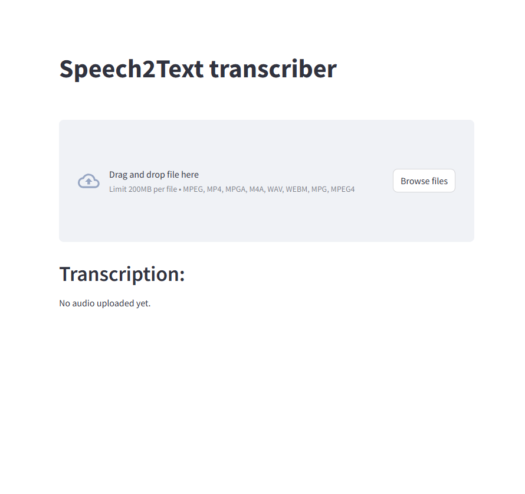

# Speech2Text Transcription Project

This project provides an API endpoint to transcribe audio files into text using the Whisper model.

## Features

- Accepts audio files in various formats: mp3, mp4, mpeg, mpga, m4a, wav, and webm.
- Transcribes the audio content to text.
- Deletes the audio file after transcription.



## Requirements

- Python 3.9+
- FastAPI
- Openai-whisper
- Uvicorn
- Streamlit

## Installation

1. Clone the repository:

    ```sh
    git clone https://github.com/yourusername/textToSpeechProject.git
    cd textToSpeechProject
    ```

2. Create a virtual environment and activate it:

    ```sh
    python3 -m venv venv
    source venv/bin/activate
    ```

3. Install the required packages:

    ```sh
    pip install -r requirements.txt
    ```

## Usage

1. Run the FastAPI application:

    ```sh
    uvicorn controller:app --reload
    ```

2. Use Postman or `curl` to post an audio file to the `/audio` endpoint:

    ```sh
    curl -X POST "http://127.0.0.1:8000/audio" -F "file=@/path/to/your/audiofile.mp3"
    ```

    Replace `/path/to/your/audiofile.mp3` with the path to your audio file.

## Run in streamlit

1. Run the streamlit application:
```sh
streamlit run main.py --server.headless true
```

2. Open the url in a browser


## Example

Here is an example of how to use the API with Python and the `requests` library:

```python
import requests

url = "http://127.0.0.1:8000/audio"
file_path = "/path/to/your/audiofile.mp3"

with open(file_path, "rb") as f:
    files = {"file": f}
    response = requests.post(url, files=files)

print(response.json())